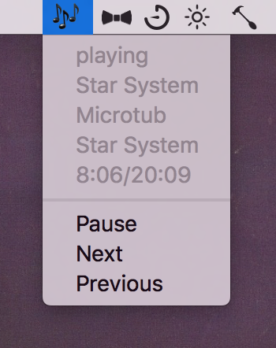

# SqueezeMenu
Shows whats currently playing + controls in menubar. Works with Logitech Media Server 7.6+ and Hammerspoon.



## Usage
Unzip spoon in `~/.hammerspoon/Spoons`

```
hs.settings.set("squeezeconfig",
                {serverURL = "http://192.168.178.20:9002/",
                 playerId = "00:00:00:00:00:00"})
hs.loadSpoon("SqueezeMenu")
```
